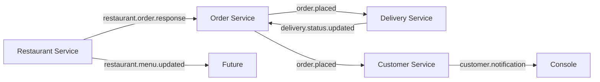

# QuickBite — Food Delivery Microservices Platform

A microservices-based backend for a food delivery platform, built as part of the **IT4020 — Modern Topics in IT** module at SLIIT.

## Architecture

```
                            ┌─────────────────┐
                            │   API Gateway    │
                            │   (Port 8080)    │
                            └────────┬────────┘
                                     │
              ┌──────────┬───────────┼───────────┬──────────┐
              │          │           │           │          │
              ▼          ▼           ▼           ▼          │
     ┌────────────┐ ┌──────────┐ ┌──────────┐ ┌──────────┐│
     │ Restaurant │ │  Order   │ │ Delivery │ │ Customer ││
     │  Service   │ │ Service  │ │ Service  │ │ Service  ││
     │ (8081)     │ │ (8082)   │ │ (8083)   │ │ (8084)   ││
     │ Java/SB    │ │ Go/Chi   │ │ Go/Chi   │ │ Java/SB  ││
     └─────┬──────┘ └────┬─────┘ └────┬─────┘ └────┬─────┘│
           │              │            │             │      │
           ▼              ▼            ▼             ▼      │
     ┌──────────────────────────────────────────────────┐   │
     │                Apache Kafka                      │   │
     └──────────────────────────────────────────────────┘   │
                                                            │
     ┌──────────────────────────────────────────────────┐   │
     │           PostgreSQL 16 (4 databases)            │   │
     │  restaurant_db │ order_db │ delivery_db │ cust_db│   │
     └──────────────────────────────────────────────────┘   │
```

## Tech Stack

| Layer              | Technology                                      |
|--------------------|--------------------------------------------------|
| Languages          | Java 21 (Spring Boot 3.2) + Go 1.22 (Chi + GORM)|
| API Gateway        | Spring Cloud Gateway                             |
| Databases          | PostgreSQL 16 (one per service)                  |
| Migrations         | Liquibase (Java) / golang-migrate (Go)           |
| Messaging          | Apache Kafka                                     |
| API Docs           | Swagger / OpenAPI 3.0                            |
| Containerization   | Docker + Docker Compose                          |

## Kafka Event Flow



## Prerequisites

- Docker Desktop (Docker Engine 20.10+ and Docker Compose V2)
- At least 8 GB RAM allocated to Docker

## Quick Start

```bash
# Clone the repository
git clone <repo-url>
cd quickbite

# Start all services
docker compose up --build

# Wait for all services to be healthy (1-2 minutes on first run)
```

Once running, all services are accessible through the API Gateway at `http://localhost:8080`.

## Service Endpoints

### API Gateway (http://localhost:8080)

All requests go through the gateway. Paths are forwarded to the appropriate service.

### Restaurant Service (port 8081)

| Method | Endpoint                                      | Description       |
|--------|-----------------------------------------------|-------------------|
| POST   | `/api/restaurants`                             | Create restaurant |
| GET    | `/api/restaurants?page=0&size=10&cuisineType=` | List restaurants  |
| GET    | `/api/restaurants/{id}`                        | Get by ID         |
| PUT    | `/api/restaurants/{id}`                        | Update            |
| DELETE | `/api/restaurants/{id}`                        | Soft delete       |
| POST   | `/api/restaurants/{id}/menu-items`             | Add menu item     |
| GET    | `/api/restaurants/{id}/menu-items`             | List menu items   |
| PUT    | `/api/restaurants/{id}/menu-items/{itemId}`    | Update item       |
| DELETE | `/api/restaurants/{id}/menu-items/{itemId}`    | Remove item       |

### Order Service (port 8082)

| Method | Endpoint                    | Description                      |
|--------|-----------------------------|----------------------------------|
| POST   | `/api/orders`               | Place order                      |
| GET    | `/api/orders`               | List (filter: customer_id, status, dates) |
| GET    | `/api/orders/{id}`          | Get order details                |
| PATCH  | `/api/orders/{id}/status`   | Update status                    |
| DELETE | `/api/orders/{id}`          | Cancel (only if PLACED)          |

### Delivery Service (port 8083)

| Method | Endpoint                            | Description          |
|--------|-------------------------------------|----------------------|
| POST   | `/api/drivers`                      | Register driver      |
| GET    | `/api/drivers?available=true`       | List drivers         |
| PUT    | `/api/drivers/{id}`                 | Update driver        |
| GET    | `/api/deliveries`                   | List deliveries      |
| GET    | `/api/deliveries/{id}`              | Delivery details     |
| PATCH  | `/api/deliveries/{id}/status`       | Update status        |
| GET    | `/api/deliveries/order/{orderId}`   | Get by order ID      |

### Customer Service (port 8084)

| Method | Endpoint                                  | Description      |
|--------|-------------------------------------------|------------------|
| POST   | `/api/customers`                          | Register         |
| GET    | `/api/customers`                          | List             |
| GET    | `/api/customers/{id}`                     | Get profile      |
| PUT    | `/api/customers/{id}`                     | Update           |
| DELETE | `/api/customers/{id}`                     | Soft delete      |
| POST   | `/api/customers/{id}/addresses`           | Add address      |
| GET    | `/api/customers/{id}/addresses`           | List addresses   |
| DELETE | `/api/customers/{id}/addresses/{addrId}`  | Remove address   |
| GET    | `/api/customers/{id}/order-history`       | Order history    |

## Swagger UI

| Service             | Direct URL                                     |
|---------------------|-------------------------------------------------|
| Restaurant Service  | http://localhost:8081/swagger-ui.html            |
| Order Service       | http://localhost:8082/swagger/index.html         |
| Delivery Service    | http://localhost:8083/swagger/index.html         |
| Customer Service    | http://localhost:8084/swagger-ui.html            |

## Seed Data

After all services are running, you can load seed data:

```bash
docker exec -i quickbite-postgres psql -U quickbite < scripts/seed-data.sql
```

This creates:
- 3 restaurants with 5 menu items each
- 5 customers with 2 addresses each
- 2 delivery drivers
- 3 sample orders in various statuses

## Stopping

```bash
docker compose down          # Stop and remove containers
docker compose down -v       # Also remove volumes (database data)
```

## Team Contributions

| Member   | Service             | Technology         |
|----------|---------------------|--------------------|
| Member A | restaurant-service  | Java / Spring Boot |
| Member B | order-service       | Go / Chi + GORM    |
| Member C | delivery-service    | Go / Chi + GORM    |
| Member D | customer-service    | Java / Spring Boot |

## Project Structure

```
quickbite/
├── docker-compose.yml
├── README.md
├── scripts/
│   ├── init-databases.sql
│   └── seed-data.sql
├── api-gateway/              (Java / Spring Cloud Gateway)
├── restaurant-service/       (Java / Spring Boot)
├── order-service/            (Go / Chi + GORM)
├── delivery-service/         (Go / Chi + GORM)
└── customer-service/         (Java / Spring Boot)
```
